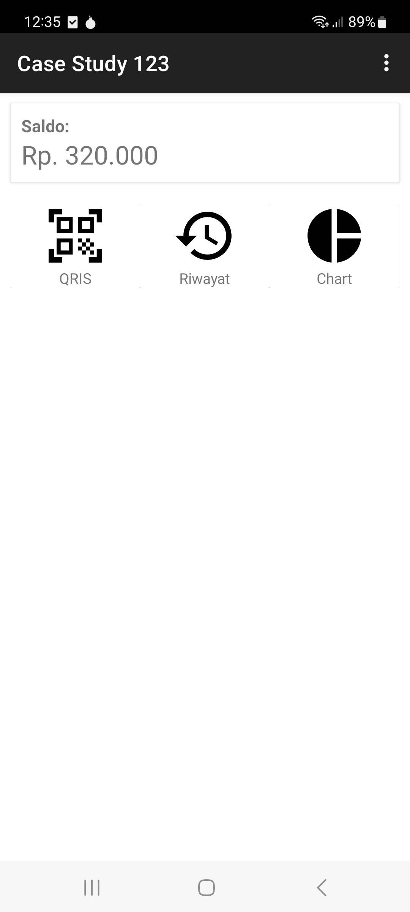
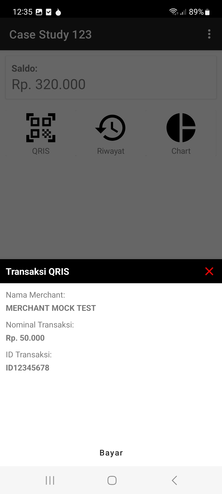
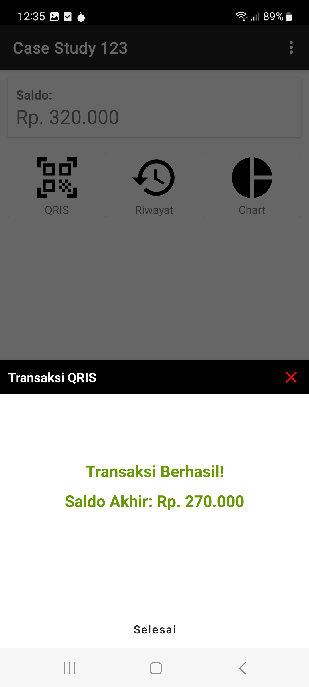
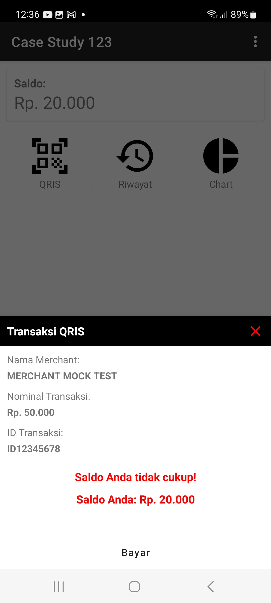
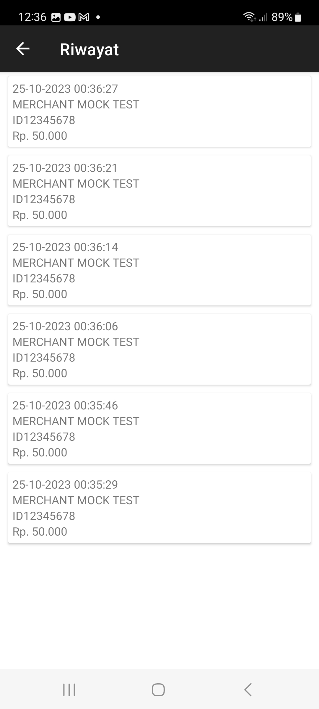
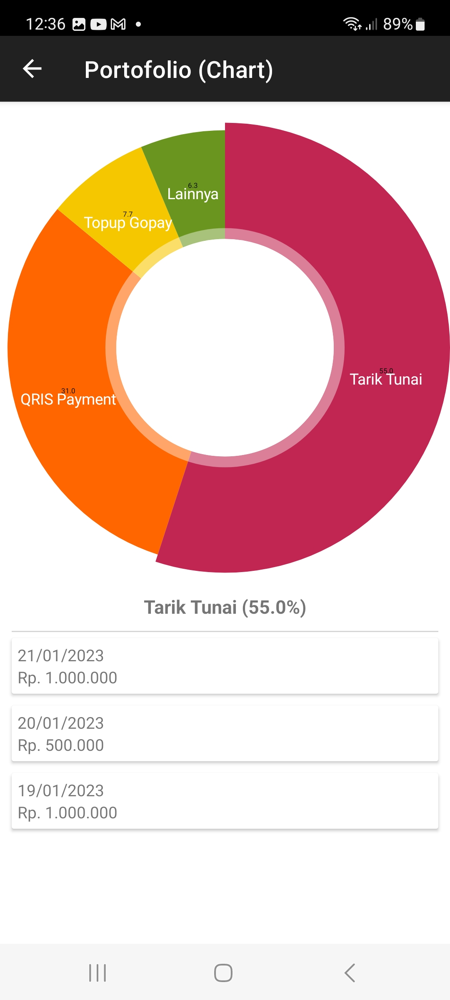

# CaseStudy123-Android

**Screenshots:**
|                |  |  |
| --------------------------------------------------- | ------------------------------------------------- | ---------------------------------------------------- |
|  |           |                |

**QR Code Sample:**

  

**Technology Stack:**
- Kotlin Programming Language
- Clean Architecture
- MVVM Architecture Pattern
- Hilt Dependency Injection
- Navigation Graph
- View Binding, Data Binding
- ViewModel
- LiveData
- ROOM Database
- Coroutine
- RxKotlin
- GSON Serialization
- ML Kit for QR code scanning
- MPAndroidChart
- Unit Test: JUnit, Mockito, MockWebServer, Robolectric
- Code Coverage: JaCoCo
- Gradle build flavors
- BuildSrc + Kotlin DSL
- Proguard
- Git

**To run the project in DEBUG MODE:**

Just clone the project, open in Android Studio, and run the project.

**To run Code Coverage (JaCoCo):**
1. Open Terminal then move to "root_project" directory.
2. type "./gradlew codeCoverModules allDebugCodeCoverage" (enter), wait until finish executing.

The report file will be located in "root_project/build/reports/jacoco/allDebugCoverage/html/index.html", open it with browser.

**Caution:**
**Later I will add more unit tests to increase the code coverage value.**
